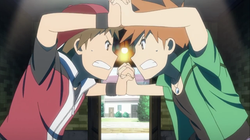

# Nuzlock Nemesis

**Nuzlock Nemesis** is a competitive challenge between two players, where every decision can determine victory or defeat. Test your knowledge, your choices, and your ability to outsmart opponents under pressure.

---

## Competition Rules

- **Version Duet** – Each player must play a different official version of the same Pokémon game (e.g., Red and Blue, or Gold and Silver) to ensure both face equivalent challenges of the same generation.

- **My Rival** – Each player must name their in-game Rival (NPC) with the same name as their opponent's.

- **Untouched Game** – The game must remain in its original state, with no patches, hacks, randomizers, cheats, or any modifications that alter gameplay, available Pokémon, events, or official mechanics.

- **Rival Duels** – All duels against rivals must occur simultaneously, meaning both players must face their rival battles at the same time. Dynamic or optional rival encounters (e.g., side encounters) must only be triggered by mutual agreement between the players. Players cannot force such battles without consent.

- **Dominance Duel** – After each battle against a Rival (NPC), players must face each other in a Best of Three (B3) match using the exact same Pokémon that participated in and survived that battle against the Rival.
If this is the **first Dominance Duel** (the one that occurs after receiving your Starter Pokémon), the duel must take place at the first Pokémon Center the players encounter, and at the end of the B3, both players are subject to the **Mark of Rivalry** rule. If this is not the first battle, the duel must take place at the nearest Pokémon Center, and the winner must apply the **Pink Slip** rule to the defeated player. The permanent death rule **does not apply** to Dominance Duels.

- **Mark of Rivalry** – During the first Dominance Duel, inexperience and the rivalry between you and your rival push your Pokémon to their limits. The injuries sustained are severe, and your Starter Pokémon has no chance of recovery.
Between the first and second Dominance Duel, he must be classified as "Dead" and subjected to the **Hall of Remembrance** rule.

- **Pink Slip** – After a Dominance Duel, the winner chooses a Pokémon from the defeated opponent's team. The trade occurs at the nearest Pokémon Center, where the winner may offer any Pokémon as exchange, and the loser must send the chosen Pokémon.

- **Negotiations Allowed** – Players may negotiate at any time, and once an agreement is made, both parties must fulfill it without exception.

- **Limited Capture** – Only the first Pokémon encountered in each area may be captured.

- **Mandatory Nicknames** – All captured Pokémon must receive nicknames to create a bond.

- **Permanent Death** – If a Pokémon faints, it is considered "dead" and must be subjected to the Hall of Remembrance rule.

- **Hall of Remembrance** – "Dead" Pokémon must be moved to a separate box in the player's PC called the "Hall of Remembrance" and cannot be used again.

- **Game Over** – When all Pokémon in the team have fainted, the challenge ends and the player is declared the loser.

- **Exclusive HM** – Each HM can only be taught to one Pokémon at a time. No two or more Pokémon may have the same HM simultaneously.

- **No Rematches** – Players may not replay battles against NPCs or rivals to improve results or level Pokémon. Each encounter must be played only once.

- **Healing Items Limit** – Healing and recovery items may only be used during battles. Using these items outside of combat to restore HP, PP, or status is prohibited.

- **Accidental Death Rule** – If you accidentally kill a Pokémon while trying to catch it, you may no longer capture or kill a Pokémon from that Route.

- **No Way Out Gyms** – Once you enter a Gym or Dojo, you cannot leave until you defeat ALL TRAINERS. Beat it or die.

- **One Shot Dungeons** – You may only enter a dungeon once unless the story requires a revisit. A dungeon includes:
  - Any hideout  
  - Any cave  
  - Any building with trainers  
  *(Forests are not considered dungeons.)*

- **Shiny Clause** – If you encounter a shiny Pokémon, you may choose to kill or catch it as a bonus encounter on that route.

- **"Set" Battles Only** – Players must use the "Set" battle type in the game settings.

- **Limited Healing Center Usage in Dungeons** – Healing centers found in dungeons (e.g., Rocket Hideout, SS Anne bed) may only be used once per dungeon. Story-mandated healing events are still allowed.

- **No Shops** – You can only use items that you pick up or are given by an NPC, no use of stores except for any type of Pokeball, Repel or Evolution Stones. You cannot ask an NPC to buy items for you (e.g. Mom), nor can you buy items to trade them for other items (e.g. Poké Balls -> Full Restores)

---

---